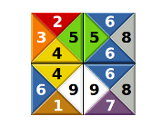

# Programmation-parallele-Tetravex



## 1. Manuel d’utilisation
### Fichier
`Chess.h`
Qui est compose par 4 chiffres(gauche, haut, droite, base) et un variable (used) boolean initial est false.

`Game.cpp`
C’est la principe de l’application


### Compiler
A l’aide de la commande suivante :
```Bash
g++ -std=c++11 Game.cpp -o game -lpthread -O3 -g3
```
  
### Démarré

Dans la dossier, y a 4 fichiers(5x5,6x6,7x7 et 8x8), vous pouvez démarrer le jeu grâce à la commande suivant :
```Bash    
time ./game nomDuFichier.txt
``` 
    
## 2. Algorithmes de backtracking
Tout d’abord, il a deux paramètres, un table de type Chess et une position</br>

Récursive ligne par ligne, case par case, de gauche à droite. Cycle toutes les pièces, si la
pièce n’a pas été utilisée et répond aux règles, qui passe la case suivant, si y a pas la pièce
correspondant, qui retour la case précédent. Jusqu’à la fin trouve le bon résultat.

 ## 3. Les résultats
 
| Fichier    | Sequentielle  | Parallele  |
| ---------- |:-------------:| ----------:|
| Puzzle5x5  |   0m0.005s    |  0m0.006s  |
| Puzzle6x6  |   0m0.021s    |  0m0.026s  |
| Puzzle7x7  |   0m4.616s    |  0m4.723s  |
| Puzzle8x8  |   4m53.248s   |  1m22.498s |


D’après mes données, on peut voir qu’il n’y a pas de grande différence entre le mode
parallèle et le mode séquentielle lorsqu’une petite quantité de calcul est nécessaire.
Parfois même le temps nécessaire pour le mode séquentielle est plus court, car en mode
séquentielle, elle arrête immédiatement la récursive lorsqu’elle trouve la réponse. mais le
mode parallèle exécutera le thread en cours après avoir trouvé la réponse.</br>
    
Dans le cas d’un grand nombre de calculs, les avantages du mode parallèle sont
évidents. Réduisez considérablement le temps de calcul, et la réponse se trouve à la
vitesse la plus rapide (le nombre de threads ici est le nombre de pièces d’échecs sur une ligne).</br>
        
Par conséquent, le mode parallèle n’est le meilleur choix pour tous les cas, ou il doit être
décidé en fonction du projet spécifique</br>
